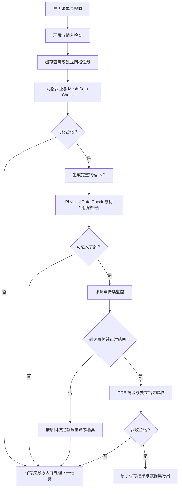

# DiffuMeta / Abaqus 批量曲面自动化：完整架构与实施方案 v1.0

> [HISTORICAL 设计文档说明 2026-09-16 加注]：本文是 2026-09-12 的原始完整设计文档，
> 作为历史架构参考原样保留。当前的阶段定义与施工顺序以 `docs/PROJECT_ROADMAP.md`
> 与 `docs/IMPLEMENTATION_PLAN.md` 为准；当前能力与验证状态以根目录 `README.md`
> 与 `docs/HANDOFF_CURRENT.md` 为准。文中"当前交付/尚未实现"等表述均为写作时点状态。

日期：2026-09-12。配套程序：`DiffuMeta_Automation_v0.1`。

本文设计一套从曲面方程到合格有限元数据的自动化系统，面向 23,534 个及更多周期壳曲面。当前交付完成整体设计，并实现可独立验证的基础模块；完整物理 INP、真实 Abaqus 作业调度和最终数据入库将在以下固定接口上逐步接通。

**本次最关键的决策：保留已验证的 Periodic Surface Mesher v1.0，以普通 Python 负责配置、建模文本、调度和质量判断，以 Abaqus 求解器负责计算，以 Abaqus 自带 Python 读取 ODB。**

## 1. 当前事实、证据与目标的边界

本次核对了八份附件，包括论文正文、补充材料、两份操作记录、三份交接 Markdown 和网格源码包；重点复核了 FE 方法、数据格式、PBC 脚本、实际失败诊断和最新自动化规划。对关键论文图表进行了页面渲染核对。

| 项目 | 可以依据附件确认的状态 | 对自动化的含义 |
|---|---|---|
| 周期网格算法 | Fig.1 已通过独立 validator 和 Abaqus 2026 Mesh Data Check | 保留核心，外加任务隔离、缓存和运行管理 |
| 其他两万多种曲面的网格稳健性 | 附件未提供大批量成功率 | 单基准成功不能转换为全体样本成功保证 |
| 单曲面物理建模流程 | 导入、厚度、PBC、刚板、接触、加载与输出已实际运行 | 可以开始程序化复刻 |
| 完整 30% 压缩验收 | 最新交接记录两次试算在极小增量处停止；本次未提供完整完成的 INP/ODB/日志原件 | 自动建模工作继续推进，但正式批量接收需完成该验收 |
| 材料 | 用户允许未来更换实验材料；当前 Plastic 是示例/近似 | 材料作为独立配置和独立版本，不能绑定 UMA90 |
| 当前上传源码 | 包含 00–07、CGAL 源码及文档；`cases/` 没有已生成网格，未附 Windows exe | 本环境无法凭附件直接重跑真实 Fig.1 Abaqus 仿真 |

如果用户本地在交接文件之后已经完整算完，应把那次结果登记为新的基准；这不会改变本文架构。

有两点需要修正此前记录中的概括：

- `Step Time=0.72` 不是“72% 压缩”，也不是必然对应 `0.72×30%`。若幅值确为 `(0,0)→(1,1)` 的 Smooth Step，则 `a(s)=10s³−15s⁴+6s⁵`。在目标 30% 的前提下，`s=0.6083` 对应约 **20.90%**，`s=0.72` 对应约 **25.87%**。最终以实际 `RP_TOP.U3` 为准。
- 塑性表末端平台可能与卡滞相关，但“达到最后一条塑性数据”本身不证明本构错误，也不能证明唯一失败原因。理想塑性可以是合法物理模型；自动化不能通过随意添加硬化尾段掩盖求解困难。

## 2. 系统究竟应实现什么

操作者准备一个曲面清单，选择材料、边界模式、加载和数值配置，然后发起一次批次。系统对每个任务独立完成网格、建模、检查、求解和结果提取，并持续更新状态。

“无人值守”应理解为：**不需要逐个样本人工操作，失败能被控制、解释和隔离。** 它不能保证任何几何、本构和大变形接触组合都收敛。

每个任务最终有明确结局：`ACCEPTED`、`REJECTED`、`NEEDS_REVIEW`、`DEFERRED` 或 `INTERRUPTED`。只有 `ACCEPTED` 可以进入正式训练集。操作性失败不能直接贴成“力学上不可能”的标签。

## 3. 总流程



重试在新 attempt 目录运行，根据失败发生的阶段复用有效上游产物；图中省略了这些返回边以保持可读性。

## 4. 三种运行环境与两层 Python

| 运行者 | 负责工作 | 不应混入的依赖 |
|---|---|---|
| 普通 Python / 已有 `diffumeta_geo` | 输入校验、网格 Python 步骤、写 INP、状态库、调度、CSV/JSON 检查 | 不需要 `abaqus`、`mdb`、`odbAccess` |
| 已编译的 CGAL 可执行文件 | 既有 Periodic_3 网格核心 | 每个曲面不重新编译 |
| Abaqus 求解器 | Mesh/Physical Data Check 和正式 Standard 求解 | 由命令行启动，无需打开 GUI |
| Abaqus 自带 Python | 读取 ODB、导出 history/field/诊断 | 不把外部 Anaconda 的 NumPy/SymPy 强装进 Abaqus |

第一版把普通 Python 与现有几何环境共用，减少环境数量。Abaqus Python 独立作为子进程。两侧通过 JSON、CSV、NPZ、INP 交换数据，不跨 Python 解释器传内存对象。

CGAL 的运行时 DLL 路径由子进程自己的环境提供。主控脚本不修改系统 PATH，不依赖操作者每个曲面切换终端。VS Native Tools 主要用于一次性编译；能否直接运行 exe 取决于 DLL 和运行库是否齐全，须在本机预检。

## 5. 代码与运行数据的目录

建议代码放在 `E:\Git\DiffuMeta_Automation`；计算数据单独放在空间足够的盘，例如 `F:\DiffuMeta_Runs`。这是示例布局，不要求移动现有工程。

| 相对路径 | 内容 | 是否放 Git |
|---|---|---|
| `vendor/periodic_surface_mesher_v1.0/` | 上传的冻结网格源码 | 是，保留版本与校验值 |
| `config/cases/` | 曲面方程与几何参数 | 小规模配置可以；大清单单独管理 |
| `config/materials/` | 材料卡、来源、适用范围、版本 | 是 |
| `config/physics*.json` | 厚度规则、边界模式、摩擦、加载路径 | 是 |
| `config/numerics*.json` | 增量、CPU、监控和重试预算 | 是 |
| `config/quality*.json` | 验收门槛、规则版本 | 是 |
| `config/environment.local.json` | 本机 Python/exe/Abaqus 路径 | 可不提交；示例文件提交 |
| `pipeline/` | 可复用功能模块 | 是 |
| `abaqus_worker/` | 仅由 Abaqus Python 执行的脚本 | 是 |
| `tests/` | 关键逻辑验证 | 是 |
| `docs/` | 方案、数据契约和实施状态 | 是 |
| `mesh_cache/<mesh_key>/` | 通过验收的不可变网格产物 | 否 |
| `runs/<run_key>/` | 某一物理问题的完整记录 | 否 |
| `state.db` | 单机 SQLite 任务账本 | 否 |
| `dataset_exports/<export_id>/` | 带版本的数据快照 | 否 |

单次求解例如：

```text
runs/r_abc123/attempts/solve_001/
```

目录内保存 `physical.inp`、全部 include 文件、配置快照、命令、环境、stdout、`job.dat/msg/sta/log/odb`。下一次重试使用 `solve_002/`，不覆盖 `solve_001/`。

## 6. 一个曲面、一个物理问题、一次求解应分开编号

不能把 `case_id=fig1` 当成所有运行的唯一标识。

| 标识 | 决定它的内容 | 作用 |
|---|---|---|
| `case_id` | 人类可读名，如 fig1 | 检索和交流 |
| `geometry_key` | 方程、单位、周期尺寸、坐标变换 | 标识几何定义 |
| `mesh_request_key` | 几何、采样、CGAL 参数、容差、seed、代码与环境版本 | 决定某次网格请求能否复用 |
| `mesh_key` | 已完成网格关键文件的内容 hash | 标识实际网格，而非仅标识计划 |
| `model_key` | 网格、材料、厚度、接触、边界、加载路径、builder 版本 | 标识实际物理模型 |
| `run_key` | model_key、数值设置、CPU、Abaqus 版本、输出计划 | 区分不同求解请求 |
| `attempt_id` | run_key 下的第几次尝试 | 保留失败与重试历史 |
| `qa_key` | 原始结果、提取器版本、质量规则版本 | 允许仅重做后处理 |

hash 是文件或规范化配置的数字指纹，用于判断“是否真的是同一输入”。不能只凭文件名或文件存在就跳过。

不会默认把 `f` 与 `-f`、平移/旋转后的方程或三角恒等式表达自动合并：它们可能涉及法向、壳 offset、加载方向和样本分组。高级几何去重另做模块，先保留方程原文和数据集原始索引。

## 7. 网格模块如何不改核心而接入批处理

源码实际行为：`meshlib/config.py` 从自身路径确定 `PROJECT_ROOT`，固定读取 `PROJECT_ROOT/config/case.json`，并在 import 时创建全局 `CFG`。仅改变 subprocess 的 `cwd`，不会改变这份配置的来源；现有脚本也没有通用 `--config` 接口。

因此，第一版采用**每个正在执行的网格 attempt 使用独立源码工作副本**：

1. 冻结 `vendor/`，记录完整源码校验值。
2. 为任务建立新的工作目录，复制 00–07 和 `meshlib/` 等必要小文件。
3. 只在该副本内写入它自己的 `config/case.json`。
4. 每个 Python stage 都启动新进程，读取此私有配置。
5. 共用只读的 CGAL exe，给它传入该任务的绝对输入路径与输出前缀。
6. 运行 05、06，执行 Mesh Data Check，再运行 07 和外层证据检查。
7. 全部通过后发布不可变的网格缓存，并清理可再生成的源码副本。

这样既不需要改已经验证的算法，也不会让 A、B 两个曲面互相覆盖配置。禁止多个线程在同一个 Python 进程反复替换全局 CFG，也禁止并发改同一个 `case.json`。

以后如果数千次复制的开销确实显著，可做 v1.1 的显式配置路径接口；那是可验证的小升级，需 Fig.1 全回归。现阶段无需提前承担这次核心改动。

## 8. 网格到 FE 的精确数据契约

| 输入 | 源码中的实际约定 | 接入检查 |
|---|---|---|
| `<case>_shell.npz` / `nodes` | `N×3`，毫米 | 非空、有限、在单胞范围内 |
| `triangles` | `M×3`，**0-based** | 整数、范围正确、非退化 |
| `x_pairs/y_pairs/z_pairs` | 每行 `(low_index,high_index)`，**0-based** | 面节点全覆盖、双射、对应向量准确 |
| `<case>_periodic_pairs.csv` | `axis,low_node,high_node,dx,dy,dz`，节点号 **1-based** | 必须逐对与 NPZ 一致；不能再次 `+1` |
| `<case>_shell_report.json` | `pass`、`nodes`、`triangles`、`cell_size_mm`、`surface_area_mm2` 等 | `pass is true`；数量和重算面积一致 |
| `<case>_meshcheck_datacheck_report.json` | 07 的网格日志结论 | 与当前 job/输入/产物 hash 绑定，不能单独作为完成凭证 |

**NPZ 内部编号转为 Abaqus 节点标签只做一次。** 程序内部统一 0-based；写 INP 的唯一出口负责 `+1`；CSV 已经是 Abaqus 标签，不再转换第二次。

Step05 当前没有把最小角和 `q_min` 作为硬拒绝门槛，也没有完整独立全局自交检查。因此必须保留这些指标，不能把 Fig.1 的 `14.419°` 或 `q=0.374` 当成所有曲面的固定下限。

## 9. 自动建模器应怎样组织

优先普通 Python 直接写 INP。对 orphan shell mesh，这条路线与既有 Step06 接口直接衔接。Abaqus/CAE `noGUI` 可用于一次性导出基准、比对或者处理特别依赖 CAE API 的功能，GUI 点击不进入批量主链。

最终 builder 输出包括：

| 产物 | 内容 |
|---|---|
| `physical.inp` | include 顺序、模型定义、分析步入口 |
| `shell_mesh.inc` | 壳节点、S3R 单元、壳集合 |
| `material_section.inc` | 材料、密度、壳截面 |
| `rigid_plates.inc` | 压板节点/单元、独立 RP、刚体关系、表面 |
| `lateral_pbc.inc` | 独立周期方程 |
| `contact.inc` | 接触域、材料交互、初始化策略 |
| `step_loading_output.inc` | Dynamic Implicit、幅值、位移、输出 |
| `model_manifest.json` | 所有数值、标签映射、集合、来源、hash |
| `pbc_map.json` | 全部原始配对、等价类、代表节点、偏移关系 |
| `build_report.json` | 静态模型检查与待验项 |

初版采用全局节点编号的 flat INP，降低 Part/Instance 编号转换复杂度。导入 CAE 后的显示名称可能改变，但力学模型可等价。后续如果采用 Part/Assembly 格式，必须通过专门 writer 处理实例限定标签，不能把 flat include 直接混用。

保留已有四个阶段概念：08=build，09=run/monitor，10=extract/QA，11=batch。入口可以短小，内部拆成职责明确的模块，无需维持四个巨大脚本。

## 10. 壳厚、材料和单位

对单胞：

\[
A_s=\sum_e A_e,\quad V=L_xL_yL_z,\quad h=\rho_r V/A_s.
\]

Fig.1 当前参考：`A_s=304.64827090489996 mm²`，`L=10 mm`，`ρ_r=0.1`，得到 `h=0.3282473906809612 mm`。节点数 9,483，S3R 数 18,164。它们是该基准的回归值，不是一般曲面的目标数量。[H1,M1]

厚度随曲面面积逐案变化。这里的 `ρ_r` 是相对密度；材料质量密度是另一个量，不能混用。采用 N-mm-s-tonne-MPa 一致单位制。例如 `1100 kg/m³ = 1.10e-9 tonne/mm³`。

`A_s h=ρ_r V` 是当前壳中面模型的体积关系，不等于已经验证任意厚度偏置实体无自交。高曲率、小间隙、厚壳极限应报告几何适用性指标，不能因公式计算成功就默认所有厚度都合理。

材料卡至少包含：模型类型、参数单位、来源、版本、密度、率相关标记、校准温度/应变率、校准应变范围以及超出范围的处置。

对普通 Plastic 表，Abaqus 所需应力/应变口径应明确为真实应力与等效塑性应变。实验工程曲线转换仅在其适用区间进行，不能把断后数据或示意点直接伪装成标定数据。材料插件将来可扩展为弹性、弹塑性、超弹性、黏弹性或 UMAT，输出变量随模型变化，例如无塑性模型不强制要求 PEEQ。

本次示例 `demo_surrogate.json` 明确标记为未实验验证，禁止自动用于正式训练集。用户以后可以选择经过验收的数值研究材料，并如实标记为 surrogate；不要求所有研究都必须先做 UMA90 实验。

## 11. PBC 的理论和可实现算法

当前目标采用 `lateral_xy_platens`：X/Y 周期，Z 由压板加载；横向宏观正应变自由求解，宏观剪切分量设为零。

一般位移差应写成：

\[
\mathbf u^+-\mathbf u^-=(\bar{\mathbf F}-\mathbf I)\Delta\mathbf X.
\]

右侧如果使用的是位移差，必须有 `−I`；若写变形后的位置差，才是 `F̄ ΔX`。旧交接中一个较早公式缺少该区分，以此处为准。

现有压缩模式下，X 对面满足 `u1+−u1−=qx`，`u2+−u2−=0`，`u3+−u3−=0`；Y 对面相应由 `qy` 控制。`qx=RP_X.U1`、`qy=RP_Y.U2` 自由，不额外给零位移。辅助节点未参与的自由度不随手全部约束。

这允许横向整体伸缩，但不等于自动实现一般各向异性材料的“所有侧向应力与剪切应力均为零”的完整单轴应力试验。压板摩擦和宏观剪切约束属于明确的边界条件选择。

### 11.1 去闭环还不够，要保证 Abaqus 消元安全

旧脚本从配对图生成 spanning forest，再按 parent/child 写 equation。在图论上可以去除闭环；但 parent 可能此前已作为 child 的自由度被消元。Abaqus/Standard 文档规定，方程第一项的自由度被消元后，不能再出现在后续 equation/MPC/tie 等约束中。因此只保证“每个 child 作为第一项一次”仍不充分。[A1]

**改进放在新的 PBC 生成器里，不改网格。**

### 11.2 用等价类代表节点直接关联

1. 只读已有 X/Y pairs，保留方向和整数周期偏移。
2. 为每个连通等价类选一个确定性代表节点，例如最小编号。
3. 遍历图，计算每个节点相对代表节点的整数偏移 `(kx,ky)`。
4. 对所有原始边验证周期偏移能闭合；不一致则失败，不通过“删一条边”隐藏矛盾。
5. 每个非代表节点只与代表节点和宏观控制节点写约束。
6. 对每个受约束自由度，第一项只在自己的方程中出现，其他方程只引用代表节点与控制节点。

形式为：

\[
u_1^a-u_1^r-k_xq_x=0,\quad
u_2^a-u_2^r-k_yq_y=0,\quad
u_3^a-u_3^r=0.
\]

若沿用三转角周期，再加 `UR_i^a−UR_i^r=0`，`i=1,2,3`。一类有 m 个节点，对应 `6(m−1)` 条方程。

X/Y 交角节点可能同时具有非零 `kx` 与 `ky`，必须保留两方向信息；不能简单把所有约束都写成单轴 high/low。

Fig.1 记录中共有 570 个参与侧向周期关系的不同节点、287 条独立关系，所以应有 283 个等价类；若保持六自由度周期，等价变换后的 equation 数仍应为 1,722。需要用真实 NPZ 验证，不能把该数字硬编码。[H1,L2]

### 11.3 PBC 验收

- 构建前：全部 pair 标签有效，覆盖和向量检查通过。
- 代数层：所有原始关系可由代表节点表达恢复；无矛盾闭环；依赖自由度不复用。
- 小测试：给定任意代表位移与 `qx/qy`，所有原始配对应满足规定位移差。
- Data Check：无约束定义错误；但其通过不能保证求解阶段不会出现奇异性。
- ODB：在保存的场帧逐对计算平移/转角残差，记录最大值及节点号。
- 初始接触调整：检查对应节点的 STRAINFREE 差值，防止初始化破坏原先周期几何。

转角相等是当前实现选择，论文没有公开这部分细节。它需在目标大转动范围内做代表性对照；不能为提高收敛率自动删掉转角约束。

## 12. 刚性压板、接触与初始状态

基准复刻先保留两块离散刚性平板、R3D4、18×18 mm、中心位于 `(5,5,0)` 和 `(5,5,10)`、板网格约 1 mm。这些是项目选择，论文并未公开这些尺寸与离散参数。[H1,L2]

每块板有独立 RP 与刚体关系。底板 RP 六自由度固定；顶板 RP 固定 U1/U2/UR1/UR2/UR3，在 U3 加载。BC 不加在板普通网格节点上，避免旧记录中错误选整块板而产生 inactive DOF 警告的问题。[L1]

建模器应明确命名壳双面表面、顶部板朝下表面、底部板朝上表面，并根据节点顺序核对 SPOS/SNEG。物理接触域为壳–壳、壳–顶板、壳–底板。General Contact 支持用命名表面成对指定接触域；是否保留 all-exterior、怎样处理边缘接触和初始化 polarity，要在原型等价性检查后固定。[A2]

不能通过排除 `(All*)/(Self)` 一次性把壳自接触关掉。也不能仅根据一条 double-sided 警告断定“刚板自接触就是唯一原因”；应结合具体节点、面方向和接触初始化结果定位。

接触定义保留 Hard Contact、允许分离、Penalty 摩擦、`μ=0.6`。壳厚与 offset 必须纳入接触一致性检查。

### 12.1 不使用统一的 h/2 平移补丁

曲面法向在边界随位置改变，厚度沿局部法向展开，并非所有节点向 Z 方向都扩展 h/2。生产版不应把上下板一律挪开 h/2 来“消除警告”。

初期采用当前 `z=0/L` 基线，按 case 读取初始化 ODB 中的 STRAINFREE，记录：最大值、相对壳厚比例、相对局部边长比例、受影响节点比例、位置分布、周期对应差值。Fig.1 的约 0.03828 mm 仅是该案例参考，不能作为通用放行值。

若以后改变压板位置、加入 seating 阶段或调整接触厚度，须建立新的物理 profile，重新定义参考高度与接触零点，并做曲线对照。这种变化不是数值重试。

### 12.2 刚体漂移策略

先保留当前 `contact_only_prototype`。若初始接触前出现刚体漂移或奇异性，检查实际刚体模态、接触是否建立和质量定义。必要时只对保留的代表自由度设计最小参考约束并进行无偏性验证；不能自动给全体边界节点锁死横向位移，也不能在每次重试中随意新增锚点。

## 13. 加载与数值设置的配置边界

基线：S3R，`NLGEOM=ON`，Dynamic Implicit、moderate dissipation，Smooth Step 压至 30%。项目记录的 T=1 s、初始增量 0.001、最小 1e-8、最大 0.02、最多 10,000 increments 是已试用设置，不代表每个曲面的最优设置。[H1]

加载路径、目标应变、时间 T、密度、阻尼设置都必须记录。即使材料率无关，Dynamic Implicit 的惯性响应也与时间和质量有关；不能称 T 完全没有物理影响。率相关材料尤其必须按实验加载速率处理，`T=ε_target/εdot` 仅适用于恒定工程应变率路径，Smooth Step 的瞬时应变率并非常数。

增加自动稳定化、切换 Explicit、质量缩放、加缺陷、换材料或改变摩擦都不是透明重试。可建立独立方法分支，但不能与原数据无标签混合。[A3]

## 14. 两道 Data Check 与四层成功证据

Mesh Data Check 只验证网格及占位材料/截面，Physical Data Check 对完整模型进行输入检查和接触初始化。两者的目录、job 名、日志和判定器分开。

每次 Data Check 至少要求：

1. 本 attempt 确实启动并结束了对应命令；退出码符合目标版本预期。
2. 当前 job 的正常完成证据存在，不能使用另一个 job 的 completed 行。
3. 必需输出非空且属于当前输入/attempt；不是旧文件或上次中断残留。
4. 诊断解析没有 fatal，且该阶段特有的检查通过。

07 现有实现只要求 `.dat/.msg` 存在并无关键字命中；这能覆盖已有网格诊断，但本身没有证明文件非空、任务真正正常结束、日志属于本次请求。外围补这些证据，不必修改 07。

**不能把 07 的 `ERROR` 正则复制成 Physical/Solve 判定器。** 正常 `.msg` 中可能出现 `MAX. CONTACT FORCE ERROR` 或 `MAX. PENETRATION ERROR`。按 `***ERROR`、已知 fatal 语句、完整诊断块和终止状态判断，保留位置与原文。`0 ERRORS` 等汇总也应按数值理解。[源码07,L2]

警告分为明确致命、已审核可接受、需复核三类。未知警告进 `NEEDS_REVIEW`，该 case 不入数据集，其他任务继续。负特征值在屈曲问题中不自动等于输入错误；持续 zero pivot、数值奇异或单元失效需结合阶段处理。

Physical Data Check 不能证明后续刚度矩阵一定非奇异，也不能证明完整 30% 压缩收敛。将这两类问题分别在输入阶段和运行阶段捕获。

## 15. 求解执行器与 watchdog

最终调用形如：

```text
abaqus job=<unique_job> input=physical.inp cpus=4 interactive
```

`interactive` 是前台等待式的命令行运行，不是打开 CAE GUI。具体 launcher 可能是 `.bat/.cmd`，Windows 适配器须处理引用与退出码；不能把用户方程插入 shell 命令。[A4]

常驻主控每数秒采集轻量信息，worker 负责运行独立外部进程。stdout/stderr 写磁盘而非无限缓存内存。每个任务独立工作目录、scratch 目录、日志和唯一 job 名。

监控要区分：启动等待、许可证等待、datacheck、求解准备、成功增量推进、cutback、无新输出、I/O 停滞和求解退出。许可证等待不能误判为非线性不收敛；矩阵分解较久也不必然是卡死。

### 15.1 极小增量卡滞

以成功增量为样本，定义窗口进度：

\[
p=(t_{last}-t_{first})/T.
\]

初始候选规则可以是：最近 100 个成功增量、窗口实际耗时至少 5 min、归一化 step time 增长小于 `1e-4`，并在两个独立窗口持续满足，再按策略停止。正式阈值用 pilot 数据定型。参考案例 `100×2.682e-7≈2.7e-5 s` 可以被该类规则识别。

另设总 walltime 上限，例如初期 2 h/case；这只是计算预算，不表示 2 h 未完成的曲面物理无效。预测剩余时间只用于预警，不能只凭不稳定的外推估计立刻终止。

采用 incremental/tail 读取，不每几秒重新读取整个大 `.msg`。`.sta` 解析需匹配 Abaqus 2026 的真实列、cutback/attempt 标记和 Fortran 科学计数法；只统计成功 increment，不能把重试尝试算作已完成进度。

### 15.2 停止必须针对本任务

先对当前目录中的唯一 job 发 Abaqus terminate 命令，等待合理清理时间，再确认其 solver 子进程确实结束。必要时终止已记录 PID、启动时间和进程树对应的本任务。不得全局结束所有 `standard.exe` 或所有 Abaqus 进程。[A5]

Windows 首选 Job Object 或已验证的进程树管理；不能仅杀掉 Python 外壳就假定 solver 已停止。不能在 solver 仍运行时删除 `.lck`、ODB 或工作目录。异常中断后先核实进程身份再恢复调度。

## 16. 失败、重试与隔离

| 失败类别 | 默认动作 | 可否复用上游 |
|---|---|---|
| 方程非法、空曲面、非流形、当前 seam 不支持 | 记录并隔离 | 不进入 FE |
| CGAL 超时/崩溃 | 有限的已验证网格策略重试 | 保留前处理，参数变动需新 mesh_request_key |
| 周期配对或 CSV/NPZ 不一致 | 停止该 case，定位数据链 | 不通过放大容差修复 |
| Physical INP 语法/section/约束错误 | 修 builder，不给每个 case 无限重跑 | 同一错误高频出现时暂停派发 |
| 许可证或磁盘暂不可用 | `DEFERRED`，资源恢复后重新排队 | 复用已有全部产物 |
| 非线性不收敛/卡滞 | 一次已验证的数值重试；仍失败隔离 | 同网格与物理配置 |
| 求解正常结束但惯性过大 | `QUASISTATIC_FAIL`，进入单独的再验证策略 | 不能直接纳入数据 |
| ODB 提取失败 | 修提取器，再读原 ODB | 不重新网格或求解 |
| QA 规则升级 | 新 qa_key，重新验收原始结果 | 不重新 FE |

初期建议 base 加最多一次数值重试。重试预设必须有明确理由：例如减小起始/最大增量并检查步数预算，不能承诺对所有卡滞有效。对“已经用极小步长成功爬行”的情况，再减小步长未必有帮助，默认隔离通常更合理。

每次重试保存参数 diff。物理配置应完全一致；如果改加载时间或求解方法，建立新的运行变体并通过准静态/路径等价性验证，不视作无条件等价。

重划网格会改变数值离散，应记录 mesh_key，继续维持同一个物理厚度规则并重新验收。不允许为了通过检查随意降低质量要求。

## 17. SQLite 状态账本与断点恢复

首版采用单机 SQLite，本地磁盘 WAL 模式，主控集中写入；worker 返回小的阶段报告。没有必要先部署分布式数据库或消息队列。

数据至少分为 runs、attempts、artifacts、events、accepted_results。保存配置、输入/输出 hash、当前阶段、所有尝试、job 名、主机、PID、进程启动时间、心跳、用时、失败码及原文位置。不能仅保留一个 `retry_count` 覆盖完整历史。

阶段状态与最终数据验收分离：`BUILD/PASS` 不等于整个 case `ACCEPTED`。

重启后的恢复顺序：

1. 读取未终结的 attempts。
2. 对 RUNNING 任务核实主机、PID、启动时间、job 名和进程树；心跳超时不能单独证明 solver 已停止。
3. 如果进程仍在，重新接管监控，不重复提交。
4. 如果进程已结束且有正常完成结果，重建阶段报告，继续提取/QA。
5. 如果阶段仅有部分输出，保留目录，标记 INTERRUPTED，按预算创建新 attempt。
6. 仅当输入 fingerprint、输出 hash 和通过证据一致时跳过已完成阶段。

正常断点续跑指阶段级复用；**不默认承诺 Abaqus 可以从任意中断增量继续。** 真正 solver restart 需要预先保存对应 restart 文件、满足版本和模型兼容要求，并单独验证。

配置文件、报告和 CSV 先写临时文件，flush 后同卷原子重命名。数据文件成功落盘后再提交 SQLite 状态。若崩溃发生在二者之间，恢复器可根据内容 hash 重新登记；不能因目录里出现 `result.json` 就自动接受。

## 18. ODB 提取：原始历史与场信息分开

求解完成后，由 `abaqus python` 的独立 worker 以只读方式打开 ODB，完成后关闭，不在普通 Anaconda 中直接 import `odbAccess`。

稳定命名集合与历史区域，由 builder 的 manifest 提供；首次验证时可导出 ODB region inventory 建立映射。不能只按 `PART-1-1`、包含 TOP 的字符串或“第一个 RP”猜测对象，旧操作已证明集合选择可能出错。

| 数据 | 最低用途 | 保存策略 |
|---|---|---|
| 顶板 RP 的 U3/RF3 | 主应力–应变曲线 | 每个成功 increment 的 history |
| 底板 RP 的 U3/RF3 | 加载与反力对照 | history |
| RP_X.U1、RP_Y.U2 | 横向周期伸缩 | history |
| ALLIE、ALLKE | 准静态判据 | 尽可能 every increment，不能只看最后一点 |
| ALLAE、ALLPD、ALLWK、ETOTAL 等适用量 | 人工能量、塑性、能量平衡诊断 | 根据过程与材料支持配置 |
| 壳 U/UR | 变形、PBC 残差 | 选定场帧 |
| S、LE、PEEQ 等 | 局部状态与材料适用性 | 保留单元、积分点、section point 信息 |
| 接触压力/开闭状态/间隙等适用变量 | 接触诊断 | 按目标版本可用变量输出 |
| Data Check 中 STRAINFREE | 初始调整 | 单独提取初始帧 |

不同 history 可以具有不同时间轴。先分别保留原始 `(time,value)` 数组，再在共同覆盖区间内进行经校验的时间对齐；不能按列表行号直接相减。不同 step 的局部时间也不能直接拼接。

场数据保留单位、节点/单元标签、壳截面点以及 global/local 坐标约定，不能把壳上下表面应力简单平均后称为原始数据。

## 19. 应力–应变、11 点与 50 点

使用参考高度 H0 和参考投影面积 A0，压缩应变取正：

\[
\varepsilon_c=-U_3^{top}/H_0,\qquad
\sigma_c=s_F RF_3^{top}/A_0.
\]

` s_F ` 是用基准验证后固定的反力符号（+1 或 −1）。不能每个样本都用绝对值掩盖反向反力。原始 RF3 永远保留。

对 Fig.1，`H0=10 mm`，`A0=100 mm²`。A0 不是壳表面积，不是接触面积，不是变形后的瞬时面积。若增加 seating 阶段，需要显式定义零点与参考高度，不能偷偷自动平移曲线。

论文的 11 个目标应变为：

```text
0.016, 0.031, 0.055, 0.094, 0.149, 0.165,
0.204, 0.227, 0.267, 0.282, 0.300
```

主文说记录 50 个等应变状态；补充材料用 11 点加默认原点通过 cubic spline 重构完整曲线。由密集 history 提取目标点，和用稀疏 11 点重构曲线，是两个不同操作。[P1,P2]

首版目标点提取用可审查的分段线性插值；以后可对比 PCHIP/样条对尖峰的影响。禁止在未达到 30% 时外推 30% 应力；仅允许浮点舍入范围内的端点对齐，并记录容差。

不能把同一曲线的应变重新排序来掩盖回退；重复应变只有在对应应力也一致时才能在插值副本中合并，原始数据保留。softening 并不意味着应变回退，允许应力下降和负切线刚度。

若输出 50 个非零等应变点，明确定义为 `0.006,0.012,...,0.300`，另存初始零点；若与作者原始数组的点数习惯不一致，使用 adapter 转换而不是猜。场帧的等时间采样不等于等应变采样，Smooth Step 情况尤其如此。

## 20. 结果质量验收

最终 `ACCEPTED` 至少包括以下内容：

| 门槛 | 核查内容 | 性质 |
|---|---|---|
| 来源一致 | 所有文件属于同一 run/model/mesh/material 版本 | 必须 |
| 正常结束 | solver 完成，最后 frame/step/位移覆盖目标，进程已退出 | 必须 |
| 曲线完整 | finite、时间合理、加载方向正确、不外推 | 必须 |
| 准静态 | 有效能量区间中所有保存 history 点 `ALLKE/ALLIE<0.01` | 论文标准的离散检查 |
| 初始低能量区间 | IE 接近零时同时检查绝对 KE 与启动状态 | 工程规则，不能把区间静默删除 |
| 人工能量 | ALLAE 等相对量及峰值位置 | 工程规则，阈值需 pilot 验证 |
| PBC | 所有保存场帧中原始 pairs 的平移/转角残差 | 工程一致性 |
| 接触 | 初始调整、穿透、接触覆盖和压板边缘影响 | 工程一致性 |
| 单元状态 | distortion、法向、面积等致命问题 | 必须 |
| 材料适用范围 | 是否超过标定范围，实际材料所需状态量 | 研究标签与验收策略 |
| 诊断结局 | 未知警告或未完成检查不能自动当 PASS | 必须 |

低 IE 区间可采用 `IE>E_floor` 后计算比值，之前同时要求 `KE<K_start`，记录 floor、点数和能量原值。不能用大分母 floor 掩盖惯性，也不能在峰值超限时改用平均值通过。每 increment 输出仍然是离散检查，不代表连续时间上的数学证明。

本次 `quality.example.json` 中除 KE/IE<1% 外，其余数值均为可见的草案门槛，明确 `calibrated_for_production=false`。`ALLAE/ALLIE=5%` 也不是本论文的硬标准。

顶底反力差与惯性、约束和接触作用一起检查，不能不加条件强制它们每时刻完全相等。Equation 约束力并不自动全部体现在普通 RF 汇总中；全局平衡应按所选自由体和输出定义进行。[A1]

## 21. 保留哪些文件，如何避免丢掉将来的场信息

首批 1、5、20–50、200 个阶段保留 ODB 和完整日志，先得到真实空间统计。生产稳定后再执行明确的保留计划。

| 长期保存 | 可在验证提取成功后按策略清理 |
|---|---|
| 方程、配置快照、来源索引与全部版本信息 | CGAL 的重复可视化 `.mesh/.obj` |
| 最终 shell.npz、pairs、关键网格报告 | 可再生成的 MC 中间数据 |
| physical.inp 与全部 include、builder manifest | 私有源码运行副本 |
| 完整密集曲线、11 点、QA 报告、失败摘要 | 非代表样本的大求解中间文件 |
| 代表/异常样本的 ODB | 按策略已确认不再需要的非代表 ODB |
| 所需目标应变场数据与标签/截面点信息 | 不得在场数据尚未提取时删除其唯一 ODB |

用户希望以后利用位移/应力场，因此不能只保留 11 点后立即删掉所有 ODB。建议最低保留目标应变附近的 U、S 及相应网格与状态 metadata；若要求精确目标应变场，要控制场输出时间点或明确存储“最近帧”的实际应变，不能把两帧非线性场随意插值称为精确解。

数据集采用每个 accepted run 独立的小结果文件，再由单一 exporter 聚合 CSV/JSONL/Parquet。并发 worker 不同时写同一个大 JSON/CSV。导出用唯一 run/qa key 去重、事务提交和版本快照，便于以后边算边训练。

计算失败样本保留为诊断数据。若用于机器学习，要区分几何不可用、数值难解、预算耗尽和软件错误，防止把计算偏差学成物理规律。

## 22. 并发与资源预算

先固定 1 个 solver job 并行、每 job 4 CPU，复刻当前原型。在代表性 case 上比较 1/2/4 CPU 的耗时、内存与曲线，再决定每 job CPU 和总并发。高 CPU/job 不保证总吞吐更高。

并发限制取 CPU、内存、许可证、磁盘四项共同允许的最小值。需要给系统和几何任务保留资源；不能认为 96 GB 内存允许任意多 Abaqus 作业。每 job 的内存设置应明确单位和上限，避免每个作业都按“机器内存 90%”申请。

CGAL、Abaqus、ODB 提取分别设槽位；不同时盲目启动所有 CPU 密集任务。预算不足时延后派发，现有作业继续。若同类环境故障连续出现，例如许可证/输出盘失效，停止新派发并报告，避免把后续两万个任务全标为求解失败。

补充材料 Table S6 给出的估计是单设计 FE 约 6 min、单核，完整数据约 12 核 10 天；正文式叙述也使用约 5 min 的粗估。应引用其为作者硬件上的量级，不作为用户电脑的保证。[P2]

若 23,534 个任务平均占用一个并发槽 6 min，串行约 98.1 天；理想 4 槽约 24.5 天，12 槽约 8.2 天，尚未计入网格、失败重试、调度与 I/O。**这里是槽位，不是把每 job 的 4 核再次算成 4 倍并发。**

## 23. n×n×n 的扩展插口

| 模式 | 内部相邻单胞 | 最外层 PBC | 加载 |
|---|---|---|---|
| `lateral_xy_platens`，1×1×1 | 无需复制 | X/Y | 两块压板 |
| `lateral_xy_platens`，nx×ny×nz | 共用/合并接口节点 | 仅整个块体最外侧 X/Y | 整体底顶压板 |
| `finite_specimen_platens` | 共用/合并接口节点 | 无 | 有限试件压缩 |
| `bulk_periodic` | 共用/合并接口节点 | 最外侧 X/Y/Z | 宏观变形梯度，通常不用压板 |

复制从已验证单胞网格出发，不重新做隐式曲面网格。用原始 pairs 建立整数平移下的接口节点映射，保留 node/element label map，检查接口共享边、法向和重复面；不能只按松散坐标容差合并所有近邻。

对于 uniform nx×ny×nz，`H=nzL`、`A0=nx ny L²`、`Utop=−εH`；同一均匀材料和相对密度下壳厚保持单胞厚度。各方向宏观 jump 对应整个 supercell 的尺寸，不是仍取 L。

普通 General Contact 不会因为有 PBC equation 就自动创造跨周期镜像面。增大 supercell 可以把一部分周期镜像接触显式放进内部，也允许更长的屈曲波长，但不能数学上消除最外边界的周期接触缺失。必须做域尺寸/接触影响验证；真正 periodic contact 是单独的扩展工作。

第一版只实现单胞 lateral XY 压板模式，并在配置中对尚未支持的 repeats/mode 明确报错；不能提供看似有效但实际上仍算单胞的 n×n×n 开关。

## 24. 实施顺序与每一步的退出条件

| 阶段 | 要做什么 | 完成证据 |
|---|---|---|
| A：冻结基准 | 获取实际 shell.npz/pairs/report；登记手工 physical.inp、配置和可用日志 | 同一参考模型有清晰版本，不依赖记忆中的菜单设置 |
| B：程序化建模 | shell→厚度/材料→刚板/RP→PBC→接触→step/输出 | 自动写完整 INP；与手工模型逐块对照；Physical Data Check 通过 |
| C：单任务真实闭环 | 命令行 solve、读取 ODB、检查曲线与能量 | Fig.1 完整 30%，全部验收通过；用户选定材料即可 |
| D：可控失败 | 加监控、超时、错误分类、独立 attempt | 注入缺文件/错误配置/中断等情况后，错误可定位，不留下失控 solver |
| E：5 个差异结构 | 不同面积、seam、曲率、屈曲/接触特征 | 不改代码逐个生成；暴露的规则问题有归因 |
| F：20–50 个 pilot | 验证时间/内存/ODB 分布、警告、停滞与重试策略 | 得到阶段成功率、P50/P95、失败类别，完成规则定型 |
| G：200 个 | 队列、恢复、并发、存储与导出 | 重启能正确接续、无覆盖/重复入库，报告真实成功率 |
| H：1,000–2,000 个 | 吞吐与长期稳健性 | 无系统性数据混淆/进程失控，资源预算可预测 |
| I：全量 | 固定生产 profile 后正式计算 | 批次报告、accepted 数据快照、失败清单完整 |

A、B 的程序化工作可以现在开展，不必等完整材料复现结束；但 F 之后的生产放量不能跳过 C 的目标应变验收。不会要求对每个 case 先额外跑一遍 5% 再跑 30%；短程模型只在定位具体风险时使用。

## 25. 自动模型与手工模型如何比对

先导出当前手工 `.inp` 和实际原始结果，而不是继续从 PDF 截图恢复所有关键词。保留原件，不覆盖。

对比节点坐标与连通、单元类型、壳厚、材料卡、RP 与刚体关系、BC、PBC 方程空间、接触域、幅值、过程参数、输出。名字或约束书写形式可不同，物理关系需等价。代表节点 PBC 与旧树式 PBC 不要求文本逐行一致，需要验证表达的关系等价并符合消元规则。

尽可能固定 CPU、Abaqus 版本、初始网格与 seed。对曲线采用相同应变网格，比较归一化 L2 差、峰值及其应变、吸能积分、横向伸缩和能量峰值。先记录差异，再根据非线性分支敏感性定容差；不预先承诺屈曲问题跨 CPU 位级一致。

若修正接触定义/PBC 后曲线改变，保存两版，查清改变来源；不以“必须复制原错误曲线”为目标。

## 26. 本次配套代码已经做了什么

| 模块 | v0.1 实现情况 |
|---|---|
| 冻结 vendor | 原始网格源码完整保留，不做算法改动 |
| `run.py plan` | 可打印完整规划和未实现项 |
| `prepare-mesher` | 可建立私有工作目录并生成 00–07/CGAL/Abaqus 命令计划；不实际提交 |
| `mesh_contract.py` | 可读取真实 NPZ/CSV/report，检查编号、范围、面积、周期配对契约 |
| `pbc.py` | 已实现等价类代表节点、周期偏移一致性、独立方程生成 |
| `prepare-fe` | 可生成壳 mesh include、PBC include、label map、厚度和 model_inputs；不是完整 physical.inp |
| `state.py` | 已实现 SQLite 登记、独占 claim、owner 检查、阶段结局和事件记录基础 |
| `diagnostics.py` | 已实现避免 ERROR 子串误报的基础判断、完成证据组合、停滞检测函数 |
| `curve_qa.py` | 已实现对齐后的曲线检查、能量峰值、目标覆盖、不外推和 11 点提取 |
| `abaqus_worker/export_history.py` | 提供只读 history 导出候选脚本；本环境只检查语法，未运行真实 Abaqus ODB |
| 完整物理 INP writer | 接口和步骤已设计，尚待接上刚板/材料/接触/step 的经过验证的关键词块 |
| Windows 进程树、完整 .sta parser、自动恢复、队列 | 设计已给出，尚未接通真实执行器 |
| 完整 ODB 场/接触/PBC QA、数据入库 | 设计已给出，尚未实现 |

所有准备与曲线检查输出都明确 `dataset_eligible=false`；SQLite 也禁止本骨架把 PUBLISH 标记成 PASS。示例配置不伪装为已验证生产配置。

本次软件验证覆盖 PBC 交角/反向/闭环、目录隔离、NPZ 编号、重复领取/owner、正常接触日志不误判、卡滞、未完成曲线不外推、能量峰值、反力符号和应变回退。它们只证明这些基础逻辑，不证明 Abaqus 非线性收敛。

## 27. 下一步可以直接开始的工作

**下一步落实完整 `build_physical_inp`。** 按已固定接口，先复用真实 Fig.1 的 NPZ/pairs/report，生成 include、材料、压板/RP、PBC、接触、步与输出；再在本机 Abaqus 2026 跑 Physical Data Check，与手工 INP 对照。

需要接入的本地文件如下，它们不是这次完成设计的前置条件，而是下一次真实模型验证的输入：

- 当前 Fig.1 的 `<case>_shell.npz`、`<case>_shell_report.json`、`<case>_periodic_pairs.csv`。
- 当前手工模型导出的完整 `.inp`（如有 include 则一并提供）。
- 对应 `.dat/.msg/.sta/.log`；若已经完整达到 30%，提供那次 ODB 或原始 U3/RF3/能量 history。
- 本机 `abaqus information=release` 结果以及 Python、CGAL exe 和 Abaqus launcher 的实际路径。

完成此步后，后续监控、提取、队列与恢复都围绕同一个稳定模型接口开发，不再来回修改材料/PBC/网格文件格式。

## 28. 证据与出处

附件页码均按 PDF 文件中的物理页数计数，避免与期刊页码或补充材料页脚混淆。

| 编号 | 来源 | 本方案使用的位置 |
|---|---|---|
| P1 | `s42256-026-01218-8(4).pdf`，正文，尤其第 11–12 页 FE simulation / Fabrication | S3R、侧向 PBC、刚板、30%、μ=0.6、Dynamic Implicit、50 点、KE/IE、材料信息 |
| P2 | `42256_2026_1218_MOESM1_ESM(4).pdf`，第 3–7 页及第 14–15 页 | 方程库、筛选、厚度、网格收敛、11 点、Table S6 耗时 |
| H0 | `PROJECT_HANDOFF_DiffuMeta_Abaqus_Current_State(2).md` | 较早阶段与旧探索结论；不覆盖较新状态 |
| H1 | `PROJECT_HANDOFF_DiffuMeta_Abaqus_Automation_Full_2026-09-12(1).md` | 最新模型、两次试算、配置、n×n×n 与自动化规划 |
| M1 | `AI_HANDOFF_SPEC_Periodic_Surface_Mesher_v1.0(2).md` 与 zip 中 `REFERENCE_RESULTS.md` | 网格基准与不变量 |
| M2 | zip 中 `meshlib/config.py`、05、06、07、CGAL main.cpp 与运行脚本 | 固定配置、编号转换、输出字段、验收局限、命令接口 |
| L1 | `1、复现Abaqus仿真（初步尝试）.pdf`，249 页；尤其第 75–76、221–249 页 | Gmsh 路线失败、RP 误选、inactive DOF、raw MC 网格与法向错误 |
| L2 | `2、abaqus批量曲面建模计算.pdf`，159 页；尤其第 28–40、64–74、100–128、138–159 页 | 实际 PBC 脚本、接触调整、卡滞、材料试算、自动化设想 |

Abaqus 官方用户文档的高校镜像（核对的是 2025 文档；目标 2026 的真实关键字、日志和 ODB 行为仍需本机验证）：

- [A1 Linear Constraint Equations](https://docs.software.vt.edu/abaqusv2025/English/SIMACAECSTRefMap/simacst-c-equation.htm)：第一自由度消元限制、约束力与 RF 的区别。
- [A2 About General Contact in Abaqus/Standard](https://docs.software.vt.edu/abaqusv2025/English/SIMACAEITNRefMap/simaitn-c-contactgeneralstd.htm)：接触域、命名表面配对和自接触定义。
- [A3 Implicit Dynamic Analysis Using Direct Integration](https://docs.software.vt.edu/abaqusv2025/English/SIMACAEANLRefMap/simaanl-c-dynamic.htm)：动态隐式及耗散应用类别。
- [A4 Abaqus/Standard and Abaqus/Explicit Execution](https://docs.software.vt.edu/abaqusv2025/English/SIMACAEEXCRefMap/simaexc-c-analysisproc.htm)：命令行执行与选项。
- [A5 Abaqus Job Execution Control](https://docs.software.vt.edu/abaqusv2025/English/SIMACAEEXCRefMap/simaexc-c-suspend.htm)：job 级控制。

本文提出的任务隔离、代表节点 PBC、fingerprint/缓存、质量分级、重试预算及状态恢复属于本项目的工程设计，不是声称作者公开了同样的程序实现。
